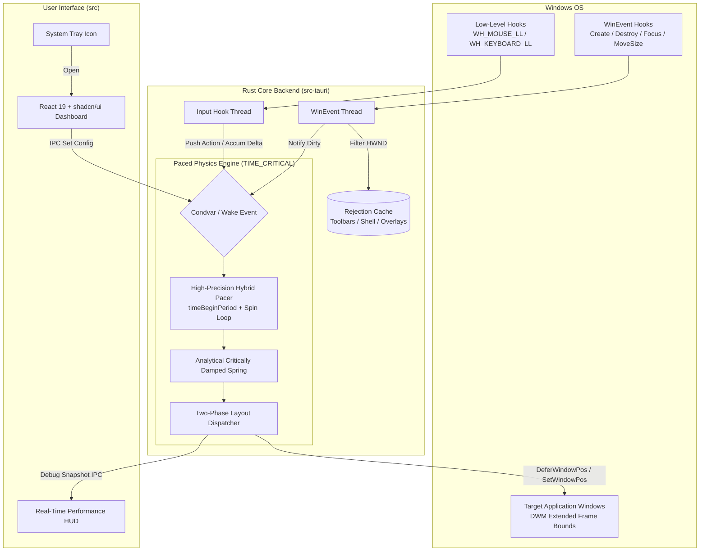

<div align="center">

# 🪟 Niri-WM for Windows

### *Infinite-Strip Scrollable Tiling Window Manager for Windows 11*

[](https://www.rust-lang.org/)
[](https://tauri.app/)
[](https://react.dev/)
[](https://tailwindcss.com/)
[](https://microsoft.com/windows)
[](#precision-frame-pacer)
[](#-license)

<p align="center">
  <b>A modern, high-performance scrollable tiling window manager bringing the paradigm of <a href="https://github.com/YaLTeR/niri">niri</a> to Windows 11.</b>
  <br />
  Featuring an analytical spring physics engine, 144Hz+ precision frame pacing, universal browser sway elimination, and a sleek tray-based configuration dashboard.
</p>

---

[Key Features](#-key-features) •
[Architecture](#-architecture--engine-internals) •
[Keybindings](#-keyboard--mouse-shortcuts) •
[Configuration](#-gui-configuration--system-tray) •
[Installation & Building](#-getting-started) •
[Troubleshooting](#-troubleshooting--faq)

---

</div>

## 🌟 Highlights

```
                       ┌─────────────────────────────────────────────────────────┐
                       │                     Physical Screen                     │
                       │             ┌───────────────┬───────────────┐           │
                       │             │               │               │           │
... ─── [ Window A ] ──┼─── [ Window B (Active) ] ───┼─── [ Window C ] ──────────┼─── [ Window D ] ─── ...
                       │             │               │               │           │
                       │             └───────────────┴───────────────┘           │
                       │               ◄── Alt + Scroll (Pan Strip) ──►          │
                       └─────────────────────────────────────────────────────────┘
```

- 📜 **Infinite Horizontal Ribbon**: Arrange application windows in a dynamic horizontal strip that scrolls infinitely and seamlessly.
- ⚡ **Ultra-Low Latency & High FPS**: Native monitor refresh rate detection (60Hz – 360Hz) with sub-millisecond spin-loop frame pacer and time-critical scheduling.
- 🎯 **Analytical Critically Damped Spring Physics**: Smooth, organic panning with closed-form second-order differential equation solvers ($y''(t) + 2\omega y'(t) + \omega^2 y(t) = 0$).
- 🛡️ **Zero-Sway Browser Engine Protection**: Custom two-phase layout pipeline prevents Chromium, Firefox WebRender, and Electron windows from lagging behind or stuttering during rapid panning.
- 📐 **Windows 11 Invisible Border Compensation**: Precise `DWMWA_EXTENDED_FRAME_BOUNDS` frame computation ensures pixel-perfect window gaps with no awkward Windows 11 drop-shadow padding.
- ⚙️ **Modern Configuration UI**: Sleek settings interface built with React 19, Tailwind CSS, and shadcn/ui accessible directly from the Windows System Tray.
- 📊 **Real-Time Performance HUD**: In-app debug overlay tracking instantaneous FPS, delta times, velocity damping, and coordinate divergence.

---

## 🚀 Key Features

### 🎛️ Scrollable Infinite Strip
Unlike traditional grid or manual-tiling window managers (like i3, bspwm, or Komorebi) that compress windows into increasingly cramped columns, Niri-WM maintains readable, comfortable window widths on an expansive horizontal strip.

### 🏎️ Dual-Phase Layout Pipeline
| Layout Phase | Target Mechanism | Win32 Flags | Benefit |
| :--- | :--- | :--- | :--- |
| **Phase 1: Structure & Sizing** | `BeginDeferWindowPos` / `EndDeferWindowPos` | `SWP_NOZORDER \| SWP_NOACTIVATE \| SWP_NOCOPYBITS` | Atomic synchronous resizing across all windows simultaneously without frame tears. |
| **Phase 2: High-Speed Panning** | Direct Non-Blocking `SetWindowPos` | `SWP_NOSIZE \| SWP_NOREDRAW \| SWP_DEFERERASE \| SWP_NOSENDCHANGING` | Bypasses heavy repaint events (`WM_PAINT`) during translation, eliminating browser sway. |

### 🧮 Physics-Driven Spring Motion
Instead of linear interpolations or clunky timer loops, the horizontal camera utilizes an analytical damped oscillator:

$$x(t) = x_{\text{target}} + \left(\Delta x + (v_0 + \omega \cdot \Delta x) \cdot t\right) \cdot e^{-\omega t}$$

where $\omega = 85.0\text{ rad/s}$ provides an ultra-responsive, overshoot-free snap.

---

## ⌨️ Keyboard & Mouse Shortcuts

All operations are designed for fluid, single-handed or keyboard-centric workflows:

| Action | Shortcut | Description |
| :--- | :--- | :--- |
| **Pan Workspace** | <kbd>Alt</kbd> + <kbd>Mouse Wheel</kbd> | Continuously scrolls the workspace strip left or right |
| **Swap Window Position** | <kbd>Alt</kbd> + <kbd>Shift</kbd> + <kbd>Mouse Wheel</kbd> | Shifts the focused window left or right in the column order |
| **Move Window Left** | <kbd>Alt</kbd> + <kbd>←</kbd> | Moves the active window one slot to the left |
| **Move Window Right** | <kbd>Alt</kbd> + <kbd>→</kbd> | Moves the active window one slot to the right |
| **Cycle Column Width** | <kbd>Alt</kbd> + <kbd>S</kbd> | Cycles active window width: `20%` → `25%` → `33%` → `50%` → `60%` → `80%` → `100%` |
| **Maximize Column** | <kbd>Alt</kbd> + <kbd>F</kbd> | Expands the active window to `100%` of screen width |
| **Focus & Center** | <kbd>Left Click</kbd> | Clicking any window automatically pans it into focus (unless dragging) |
| **Manual Resize** | <kbd>Mouse Edge Drag</kbd> | Drag any window border; the manager preserves custom column widths |

> [!TIP]
> Enable **"Snap to Applications"** in the Settings panel to make <kbd>Alt</kbd> + <kbd>Mouse Wheel</kbd> jump discretely from window to window rather than continuous pixel panning.

---

## 🏗️ Architecture & Engine Internals



### Dedicated Multi-Threaded Runtime

The backend executes across three specialized operating system threads:

1. **Precision Frame Pacer & Physics Thread (`THREAD_PRIORITY_TIME_CRITICAL`)**
   - Calls `timeBeginPeriod(1)` for 1ms multimedia timer resolution.
   - Dynamically samples monitor refresh rate (`DEVMODEW.dmDisplayFrequency`) up to 360Hz.
   - Employs hybrid `thread::sleep` for bulk frame waiting and `std::hint::spin_loop()` for sub-millisecond precision alignment.
   - Automatically idles on a zero-overhead condition variable (`Condvar`) when no motion is occurring.

2. **Low-Level Input Hook Thread (`WH_MOUSE_LL` & `WH_KEYBOARD_LL`)**
   - Intercepts scroll and key combinations before applications process them.
   - Feeds thread-safe atomic accumulators (`AtomicI32`) and wakes the engine instantly.

3. **WinEvent Listener Thread**
   - Tracks window lifecycle (`EVENT_OBJECT_CREATE`, `EVENT_OBJECT_DESTROY`, `EVENT_OBJECT_HIDE`, `EVENT_OBJECT_SHOW`).
   - Handles manual resize boundaries via `EVENT_SYSTEM_MOVESIZESTART` and `EVENT_SYSTEM_MOVESIZEEND`.
   - Maintains an accelerated HWND rejection cache to skip unmanageable elements (Taskbar, Start Menu, System Tray flyouts, tooltips, and transparent overlay windows).

---

## ⚙️ GUI Configuration & System Tray

Click the **Niri-WM** icon in your system tray to access the settings dashboard:

<div align="center">

| Section | Option | Description | Default |
| :--- | :--- | :--- | :--- |
| **General** | `Enable Tiling` | Master switch to activate or deactivate tiling window management | `Enabled` |
| **Layout** | `Window Gap` | Outer and inter-window spacing (in pixels) | `16px` |
| **Layout** | `Column Sizing Mode` | Choose between `Percentage (%)` of screen width or `Fixed Pixels (px)` | `Percentage` |
| **Layout** | `Default Column Size` | Default width for newly spawned application windows | `50%` |
| **Navigation** | `Smooth Scrolling` | Enable analytical spring physics animations for panning | `Enabled` |
| **Navigation** | `Snap to Applications` | Discrete window-by-window snapping on scroll | `Disabled` |
| **Navigation** | `Scroll Speed` | Panning velocity multiplier when smooth scrolling | `100px` |

</div>

### Real-Time Performance HUD

Activate the **Debug Overlay** via the Tray Menu:

```
┌───────────────────────────────┐
│ WM Debug                  [X] │
├───────────────────────────────┤
│ FPS                  144.0    │
│ Frame Time           6.94 ms  │
│ Smoothing           -0.0000   │
├───────────────────────────────┤
│ Target X             1280.0   │
│ Current X            1280.0   │
│ Diff                 0.00     │
└───────────────────────────────┘
```

---

## 🛠️ Getting Started

### Prerequisites

Ensure you have the following installed on your Windows 11 system:

- [Node.js](https://nodejs.org/) (v18 or higher)
- [Rust & Cargo](https://www.rust-lang.org/tools/install) (MSVC toolchain: `x86_64-pc-windows-msvc`)
- Visual Studio C++ Build Tools (with Windows 10/11 SDK)

### Clone & Install

```powershell
# Clone the repository
git clone https://github.com/your-username/wm.git
cd wm

# Install Node dependencies
npm install
```

### Running in Development Mode

```powershell
npm run tauri dev
```

### Building for Release

To compile an optimized, standalone binary and installer:

```powershell
npm run tauri build
```

The compiled binary and setup installer will be generated in:
`src-tauri/target/release/tauri-app.exe`

---

## 🔍 Technical Deep Dive

<details>
<summary><b>Click to expand: How Niri-WM solves the Windows DWM Browser Sway problem</b></summary>

### The Problem
When traditional window managers move applications like Google Chrome, Microsoft Edge, or Firefox at high framerates using standard `SetWindowPos`, the browsers' internal GPU rendering pipelines (such as WebRender or Viz) receive asynchronous `WM_WINDOWPOSCHANGING` and `WM_SIZE` messages. Because their swapchains render a few milliseconds out of phase with DWM compositing, the window contents appear to "sway", jitter, or lag behind the border frame during panning.

### The Solution
Niri-WM implements an intelligent separation of concerns:
1. **DWM Transitions Suppression**: Window-level DWM animation is forcefully disabled (`DWMWA_TRANSITIONS_FORCEDISABLED`) to eliminate OS-level interpolation delays.
2. **Selective SWP Flags**: During translation-only frames, the engine passes `SWP_NOSIZE | SWP_NOREDRAW | SWP_DEFERERASE | SWP_NOSENDCHANGING | SWP_NOCOPYBITS`. This instructs the Windows subsystem to translate the existing top-level window surface directly without triggering redundant client invalidation or blocking the browser's render thread.
3. **Discrete Integer Rasterization**: While the internal spring computes continuous floating-point coordinates ($f32$), screen commits are rounded to integer pixels with dirty-check caching (`last_rendered_int_offset`), preventing micro-stutter from subpixel rounding oscillation.

</details>

<details>
<summary><b>Click to expand: Native Windows 11 Invisible Border Correction</b></summary>

Windows 10 and 11 add invisible 7-8 pixel resizing borders around top-level windows (`rcWindow`). If a window manager positions windows using standard `GetWindowRect`, visible gaps will appear uneven.

Niri-WM inspects `DwmGetWindowAttribute` with `DWMWA_EXTENDED_FRAME_BOUNDS` and computes exact margin differentials:
```rust
border_left   = bounds.left   - win_info.rcWindow.left;
border_top    = bounds.top    - win_info.rcWindow.top;
border_right  = win_info.rcWindow.right  - bounds.right;
border_bottom = win_info.rcWindow.bottom - bounds.bottom;
```
These offsets are compensated in every layout calculation, resulting in uniform, gap-accurate tiling on Windows 11.
</details>

---

## 📋 Comparison

| Feature | Niri-WM for Windows | Traditional Grid WMs (Komorebi, GlazeWM) | Windows Snap Layouts |
| :--- | :---: | :---: | :---: |
| **Tiling Model** | **Infinite Horizontal Strip** | Fixed Screen Grid / Binary Tree | Static 2-4 Zones |
| **Navigation** | **Smooth Spring Scroll / Snap** | Directional Focus Switch | Mouse / Win+Arrow |
| **Multi-Monitor Refresh Rate** | **Up to 360Hz Synced** | Variable / Timer Polled | Native OS Fixed |
| **Browser Sway Fix** | ✅ **Native Two-Phase** | ❌ May lag during rapid resize | ❌ Not applicable |
| **Configuration** | **Live GUI Dashboard** | JSON / YAML / CLI only | Windows Settings |
| **Performance Overhead** | **~0% CPU when idle** | Low | None |

---

## 🤝 Contributing

Contributions, feature requests, and bug reports are welcome!

1. Fork the repository
2. Create your feature branch (`git checkout -b feature/AmazingFeature`)
3. Commit your changes (`git commit -m 'feat: add amazing feature'`)
4. Push to the branch (`git push origin feature/AmazingFeature`)
5. Open a Pull Request

---

## 📜 License

This project is dual-licensed under either:

- **MIT License** ([`LICENSE-MIT`](LICENSE-MIT))
- **Apache License, Version 2.0** ([`LICENSE-APACHE`](LICENSE-APACHE))

at your option.

<div align="center">
  <sub>Crafted with precision for a fluid Windows 11 desktop experience.</sub>
</div>
